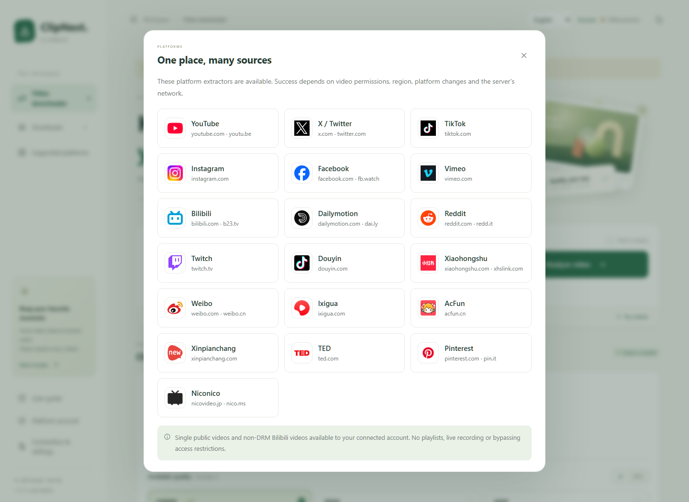
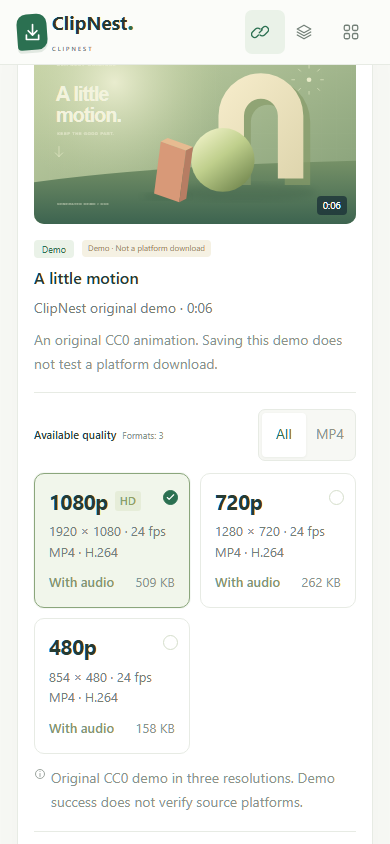

# ClipNest

**Choose a video. Pick a quality. Keep the file.**

ClipNest is an open-source video downloader with a self-hosted Web edition, an Android app that runs its engine on the phone, and an early on-device WeChat Mini Program. The editions have different capabilities and release readiness; choose the one that fits your use below.

[简体中文](README.zh-CN.md) · [Requirements & evolution](docs/REQUIREMENTS.md) · [Installation](docs/WEB_INSTALL.md) · [Validation](docs/TESTING.md)

[**Interactive preview**](https://xialuyu5-oss.github.io/clipnest/preview/) · [Introductions in 12 languages](docs/i18n/en.md)

English · [简体中文](README.zh-CN.md) · [繁體中文](docs/i18n/zh-TW.md) · [日本語](docs/i18n/ja.md) · [한국어](docs/i18n/ko.md) · [Español](docs/i18n/es.md) · [Français](docs/i18n/fr.md) · [Deutsch](docs/i18n/de.md) · [Português](docs/i18n/pt.md) · [Русский](docs/i18n/ru.md) · [العربية](docs/i18n/ar.md) · [हिन्दी](docs/i18n/hi.md)

**Website-first local processing · v1.4.0-alpha.2:** open the website, let it check
this computer, then continue automatically to the complete downloader when ready.
Missing components get specific installation prompts. Windows setup installs only
missing items after confirmation. Android adds system share-link receiving.
Extraction, media transfers and merging stay on the user's device.

[Website entry](https://xialuyu5-oss.github.io/clipnest/) · [New release notes](docs/releases/v1.4.0-alpha.2.md) · [Local setup](docs/LOCAL_PROCESSING.md)

**Current source update — 2026-09-20:** nine additional platform integrations,
19 official website icons, and an explicit local VPN proxy option. To use these
changes, run the current source or the PC package built by the current website
deployment. Existing alpha.2 Release attachments remain earlier builds. [Changes](CHANGELOG.md) ·
[Local VPN setup](docs/LOCAL_PROCESSING.md#using-an-existing-local-vpn-proxy)

The first PC visit requires installing and starting the local component. Once
ready, this tab switches to `127.0.0.1:8000`; the website does not host a video
processing service. Keep the component running while using ClipNest.

**Developed through OpenAI Vibe Coding, using OpenAI ChatGPT and Codex.** The user defined the goals, reviewed the experience and directed changes; AI generated and revised the code and documentation with tool-assisted testing. This is an independent project, not an official OpenAI product or endorsement.


*Actual interface capture from the current source, 2026-09-20. The bundled original demo is not evidence of a live platform download. The interactive preview works without installation and only uses this demo.*

<details>
<summary>19 platform integrations and their official icons</summary>



Extractor integration does not guarantee every current link works. [Test scope and restrictions](docs/PLATFORMS.md).

</details>

## Choose an edition

| Edition | Where processing runs | What you can use | Current delivery |
| --- | --- | --- | --- |
| **Web v1.3.1** | Your computer or self-hosted server | Platform link analysis, quality selection, downloads, merging, pause/resume and browser saving | Deployment ZIP/tar.gz; requires Python, FFmpeg and a supported JS runtime |
| **Android v1.4.0-alpha.2** | On the phone | Bundled extraction/download/merge engine, persistent tasks and system file export | Source and build instructions; local debug APKs tested on an emulator. Public APK attachments are held pending native dependency source/notices completion |
| **WeChat v1.4.0-alpha.1** | Inside the Mini Program on the phone | Direct HTTPS MP4 metadata, download, supported-source resumption and album export | Developer-import source ZIP; not a published Mini Program. Platform share-page parsing is unfinished |
| **iOS** | Intended to run on the phone | Shared interface, data model and native message protocol prepared for reuse | No iOS app, IPA or store entry |

[Web release notes](docs/releases/v1.3.0.md) · [Client preview notes](docs/releases/v1.4.0-alpha.1.md) · [Android guide](clients/android/README.md) · [WeChat guide](clients/wechat/README.md)

## The download experience

1. **Paste a supported video link.** Select a format returned by the source, with resolution, frame rate, codec, audio status and size where available. Unknown metadata stays unknown.
2. **Review and confirm.** Every download asks for permission and shows duration, estimated size and indicative transfer time. ClipNest sets no fixed video-size, duration or total-download-time ceiling.
3. **Follow progress.** See speed and remaining-time estimates. Android identifies current-track estimates; the Web edition distinguishes overall and current-track estimates. Unknown totals do not produce a fabricated countdown.
4. **Pause, resume or cancel.** Pause keeps checkpoints; resumption depends on the source. Cancel stops the worker and removes its cached files. Merge is cancellable but not pausable.
5. **Save the result.** Web and Android merge separate audio/video tracks when needed, without default transcoding. Export the ready file to your device. Completed files and checkpoints remain until you delete them; there is no expiry timer.

Device/server storage and source/platform runtime constraints still apply. Pre-download time ranges use a labeled **1–10 MB/s reference**, not a speed test. Files already exported are not deleted when their task is removed. See [how downloading works](docs/ARCHITECTURE.md).

The current Web and Android source integrates yt-dlp extractors for **YouTube, X / Twitter, TikTok, Instagram, Facebook, Vimeo, Bilibili, Dailymotion, Reddit, Twitch, Douyin, Xiaohongshu, Weibo, Ixigua, AcFun, Xinpianchang, TED, Pinterest and Niconico**. Integration is not universal compatibility: permissions, geography, anti-bot checks, changing sites and DRM can prevent a download. TikTok and Douyin are separate integrations. The WeChat preview accepts direct MP4 links only. [Accepted links, test evidence and limits](docs/PLATFORMS.md).

The Web edition additionally offers local Bilibili QR account login and light/dark themes. Member-HD completion remains unverified; other account-login flows and Android member login are not implemented.

## Start from the website

1. Open the [website entry](https://xialuyu5-oss.github.io/clipnest/).
2. If the local component is not installed, download and extract the PC package.
3. On Windows, run `install-missing.bat`, confirm the missing items, then run `start-local.bat`.
4. Return to the website. A ready environment opens the full interface automatically.

A stopped component or denied browser connection is reported as **not checked**,
not as proof of missing software. Allow the site's local connection if prompted.
The local component uses default port 8000. [Details and alternate systems](docs/LOCAL_PROCESSING.md).

## Run the Web edition directly

Install **Python 3.11+**, **FFmpeg with ffprobe**, and **Deno 2.3+ or Node.js 22+** for YouTube. Make them available on your system PATH. Extract the Web deployment archive or this repository, then run:

```sh
python start.py
```

Windows: double-click `start.bat`. macOS/Linux: `python3 start.py` or `bash start.sh`. The launcher creates a local virtual environment, installs Python dependencies on first run, and opens **http://127.0.0.1:8000**. Keep the service running. System runtimes are separate prerequisites.

```sh
python start.py --port 8001
python start.py --update
```

Personal local use does not require `.env`. Copy `.env.example` to `.env` only when customizing configuration; never commit that file. LAN/public hosting and member mode need deliberate configuration. [Installation](docs/WEB_INSTALL.md) · [Deployment and troubleshooting](docs/DEPLOYMENT.md)

Dockerfile and Compose are provided as recipes; Docker build/run has not been validated. Publishing source on GitHub does not deploy a running website. The generated offline UI preview cannot analyze live links.

## Languages and phone layout

English is the default. Choose **English, 简体中文, 繁體中文, 日本語, 한국어, Español, Français, Deutsch, Português, Русский, العربية or हिन्दी**. Selection is remembered; Arabic uses right-to-left layout. Source titles retain their original language. Controls have minimum touch sizes and wrap on narrow screens.

<details>
<summary>Web on a phone and the native Android preview</summary>




The first image is the responsive Web preview. The second is the separate Android application. No WeChat or iOS screenshot is implied.

</details>

## How the requirements evolved

| User request or feedback | Result |
| --- | --- |
| A website for X, YouTube, TikTok and other video links, with selectable quality | Web analysis and actual source-format selection |
| Let the user decide before downloading, regardless of size | Per-download confirmation; removed fixed file, temporary-space, duration and total-time caps |
| Explain missing audio/frame-rate information | Three audio states and best-effort Web metadata probing; no invented values |
| Default English with major languages selectable | 12 locales, remembered selection and Arabic RTL |
| Fix cramped controls; show time remaining; allow pause/resume; delete cache on cancel | Responsive control sizing, ETA and download lifecycle controls |
| Remove 60-minute retention and restart expiry | Persistent tasks and files until user deletion; interrupted work restores paused |
| Keep platform processing and video traffic on the user device | Static website entry plus local PC component; Android keeps its engine in the App |
| Check the environment on website entry, show the complete tool when ready | Automatic local detection, precise missing-component prompts and same-tab handoff |
| Add independent mobile editions and preserve useful iOS reuse | Android on-device engine; shared modules; limited pure-device WeChat implementation; iOS deferred |

Fixed limits and timed expiry were earlier implementation choices, **not original user requirements**. The WeChat share-page and merge gaps remain unfinished work, not an agreed removal of those goals. [Full edited requirements history →](docs/REQUIREMENTS.md)

## What has been verified

- **Web:** 226 Python regression tests including environment/discovery, platform routing and local-proxy checks; frontend/i18n checks; real local HTTP and HLS resumption; responsive browser flows and earlier extracted deployment-package startup on Windows. The current source also returned formats for a public X sample through an explicitly selected local proxy.
- **Android:** ARM64/x86_64 builds, APK signature verification and four Android 16 x86_64 emulator integration tests, including bundled yt-dlp loopback download and FFmpeg remux with audio/video validation.
- **Shared/WeChat:** 12-language catalogs, actual MP4 fixture metadata, HTTP Range checkpoint/resumption and byte identity, changed-source rejection and cancellation tests. wx-specific fallback/album calls use adapters in these tests.

**Not yet verified:** all platforms' current live links, real member-HD, Android physical-phone/background/large-file behavior, WeChat Developer Tools or real-device behavior, Docker, macOS or public hosting. Emulator and fixture results do not establish those scenarios. Android public binary distribution additionally needs matching native dependency source and notices. [Evidence and reproduction](docs/TESTING.md) · [Mobile gaps](docs/MOBILE_TARGETS.md)

## Source, builds and licenses

```text
app/                Web service, extraction workers, accounts and media probing
site/               Static website environment check and install guidance
web/                Responsive interface, editable translations and original demos
clients/android/    Android application and build configuration (GPL-3.0-only)
clients/engine/     Android worker using the Web's reusable media logic
clients/shared/     Portable domain logic, language additions and message contract
clients/mobile-ui/  Bundled interface for native adapters
clients/wechat/     Entirely on-device Mini Program development project
scripts/            Local build, translation, demo and verification tools
tests/              Backend, native-device and portable adapter tests
docs/               Requirements, installation, architecture, evidence and screenshots
```

Native device tests are under `clients/android/app/src/androidTest/`. Generated installation packages belong in Releases, not the source tree. Runtime data, actual configuration, account credentials, signing keys and local logs are excluded. [Build/release conventions](docs/RELEASING.md) · [Contributing](CONTRIBUTING.md)

Web, independent shared/interface modules and WeChat: **[MIT](LICENSE)**. Android application: **[GPL-3.0-only](clients/android/LICENSE)**. Original demo media: **[CC0 1.0](docs/ASSETS.md)**. Dependencies retain their own licenses; see [Android notices and distribution status](clients/android/THIRD_PARTY_NOTICES.md).

Use only content you own or are authorized to download. ClipNest does not remove DRM or provide rights to source media. Platform names identify integrations, not affiliation or endorsement.
