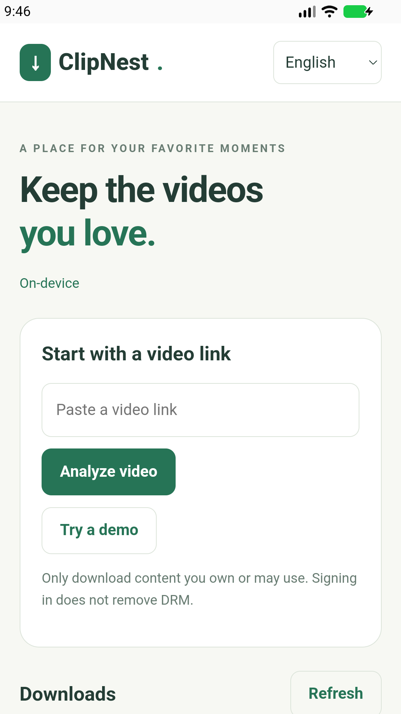

# ClipNest Android — on-device preview

This is an Android client with an actual **local yt-dlp/Python, QuickJS and FFmpeg engine**. It does not connect to the ClipNest Web service. The bundled HTML interface is a local view over an origin-restricted native message bridge; source pages are never opened inside that privileged WebView.

The Android application is **GPL-3.0-only**, as approved for the GPL engine integration. The independently maintained Web service, portable interface/domain modules and WeChat implementation retain their MIT license. See [LICENSE](LICENSE) and [third-party notes](THIRD_PARTY_NOTICES.md).



Actual emulator capture. The image shows the on-device interface; it does not demonstrate a live-platform download. Preview artifacts and verification scope are listed in the [release notes](../../docs/releases/v1.4.0-alpha.1.md).

**Source preview:** local ARM64/x86_64 development APKs have been built, but public APK attachments are held pending the [native dependency distribution work](NATIVE_DISTRIBUTION.md). The build instructions below are for local development.

## Build

- JDK 17; Android SDK platform 36 and compatible Android build tools.
- Gradle 8.13 via the included wrapper; Android Gradle Plugin 8.13.0.
- Android 8.0/API 26 or newer, ARM64 phone or x86_64 emulator.
- First build downloads declared dependencies. No engine update or source upload runs automatically.

From this directory, set `ANDROID_HOME` to your SDK and run:

```sh
sh ./gradlew :app:assembleDebug
sh ./gradlew :app:assembleDebugAndroidTest :app:lintDebug
```

On Windows use `gradlew.bat`. The explicit `sh` invocation also works when an archive or browser upload does not preserve the wrapper's executable permission. The APK is under `app/build/outputs/apk/debug/`. A debug APK is a development preview signed with a local development key, not a production Release or Play Store submission. Updates require the same signing identity.

Release preparation can use `:app:assembleRelease :app:bundleRelease`; those outputs are **unsigned** until an owner-controlled signing configuration is supplied. Do not commit signing keys or passwords. APK is the direct-install format; an AAB is not a directly installable app.

## Behavior

- Analyze a public link, choose actual available quality, review duration and indicative transfer time, explicitly confirm, then start.
- Download into the app's private directory, with a foreground notification. Separate streams are combined locally. The final file is checked using Android's media reader.
- Pause retains downloader checkpoints. Resume re-extracts the URL. If a format disappears or the source cannot resume, re-analysis/restart may be necessary.
- Cancel stops the owned worker process group before removing its task directory. Merge cannot pause.
- Tasks persist; interrupted work reopens paused. There is no timed cleanup or application file-size ceiling. Device storage and Android runtime/background limits still apply.
- **Save file** uses Android's system document picker. Exported files remain when the task is deleted.
- Includes the project's original local demo. Demo success is not evidence of a live platform download.
- No platform-account login or DRM bypass. Source extraction success depends on each site, region and current bundled extractor.

## Tests

`DeviceSmokeTest` checks the bundled native engine, a real loopback HTTP fixture download, local FFmpeg splitting/merging, media audio/video verification, consent rejection, demo tasks and deletion. Interface checks exercise the native bridge and language switching. Invoke the explicit class to avoid the legacy runner scanning all engine dependencies:

```sh
adb shell am instrument -w -e class org.clipnest.app.DeviceSmokeTest org.clipnest.app.debug.test/android.test.InstrumentationTestRunner
```

Use a dedicated emulator or test device; never clear a user's existing app data for these tests. Current executed results and unverified scope are documented in [mobile targets](../../docs/MOBILE_TARGETS.md).

## iOS reuse

The bundled mobile view, 12-language resources, JSON command/response contract, consent logic and pure media interpretation can be reused. Android's process launcher, foreground service, storage/export adapter and GPL native binaries are platform-specific. An iOS adapter must use an iOS-compatible embedded engine and media libraries; a WebView alone does not satisfy on-device downloads.
