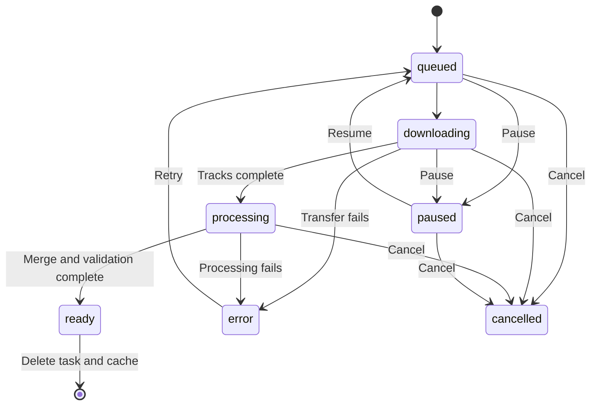

# How downloads work

ClipNest has a browser interface, a single-process FastAPI service, and isolated worker subprocesses. The browser does not scrape source platforms directly.

## Components

| Location | Responsibility |
| --- | --- |
| `web/` | Link input, quality selection, confirmation, progress, language and account UI |
| `app/main.py` | HTTP endpoints, browser sessions, task ownership, queue, persistence and file delivery |
| `app/worker.py` | yt-dlp extraction/download, progress events, FFmpeg/FFprobe integration |
| `app/media.py` | Actual format options, audio distinctions, dimensions and estimates |
| `app/probe.py` | Bounded sampling to fill missing metadata without blocking successful extraction |
| `app/process.py` | Worker lifecycle, child-process cleanup, filtered worker environment |
| `app/accounts.py` | Local Bilibili QR flow and in-memory account sessions |
| `app/safety.py` | Supported URL handling and outbound address checks |

No frontend build framework is required. Translation JSON files are bundled locally; the app does not call an online translation service.

## Analysis and download

1. The service validates the URL and expands supported short links under outbound checks.
2. yt-dlp extracts information. ClipNest builds selectable formats from actual source tracks; it does not synthesize higher resolutions.
3. If frame rate or codecs are missing, a bounded media sample may be inspected with FFprobe. Failure to probe leaves the value unknown instead of failing the whole analysis.
4. The user selects a format, confirms permission to use the content, and reviews duration, size and expected transfer time.
5. A queued worker downloads media into that task's dedicated directory. Separate audio and video streams may require more temporary disk space than the final file.
6. FFmpeg combines tracks when needed, without default re-encoding. FFprobe checks the actual result.
7. The task becomes `ready`. **Save file** starts an authenticated, same-session file transfer to the browser. The file endpoint supports HTTP Range.

There are two network legs: **source → server** and **server → browser**. The app controls the source download; the browser's download manager controls saving the final file. In a local installation, the server runs on the user's computer. In a remote installation, that machine stores and fetches the source media.

## Task lifecycle

The diagram summarizes the main paths; endpoint guards reject controls that do not apply to the current state. Processing/merging cannot pause. Cancelling stops and reaps the worker tree before deleting task files; cleanup errors are reported.

## Pause and resume

yt-dlp is configured to retain `.part` files and downloader checkpoints, including `.ytdl` metadata where applicable. Pause stops the active worker while preserving these files and any completed tracks. Resume uses the same directory and re-extracts the original URL to refresh media addresses.

- HTTP resume depends on the source accepting byte ranges and retaining compatible content.
- Fragment-based resume depends on downloader checkpoint support and a compatible playlist.
- Unsupported resume, changed formats, changed source content or expired authorization can require a restart or cause an error.
- Recoverable download errors retain existing partial files for retry; cancel/delete removes them.
- Local tests prove byte reuse and fragment reuse for the fixtures in `tests/test_engine_resume.py`, not for every platform.

## Time estimates

Before download, a known/estimated size is divided by a **1–10 MB/s reference range**. This is illustrative, not a speed test or completion promise. If the necessary information is missing, the UI says so.

During download, progress events provide speed and remaining-time inputs. Where an overall total is known, estimates account for remaining bytes; otherwise the UI identifies an estimate as belonging to the current track. Network changes, extra tracks and retries change the estimate. Merge/validation time is not included in a fabricated countdown.

## Persistence, ownership and deletion

Each task is stored under `DATA_DIR/jobs/<id>/`. Its `job.json` is written atomically and includes source URL, selected format, state and an ownership hash. Files do not have a scheduled expiry. On restart, completed files remain available and interrupted active work is restored as paused until the user resumes it.

The browser holds an HttpOnly session cookie. Stored ownership uses a one-way hash rather than the raw session secret. Recovery requires the original browser cookie; clearing site data or using another browser loses access to those tasks. There is no account-based recovery UI. Instance authentication and platform account credentials remain in memory and may need renewal after restart.

Cancellation/deletion removes server-side task files. Files already saved to a user's device are outside this cleanup. Backups of `data/` can contain source URLs and private media; they are not source-code artifacts.

## Deployment model

Run **one Uvicorn worker**. Task metadata persists, but active queue coordination, locks, instance authentication and account sessions are process-local. This is not a distributed downloader or shared multi-user identity system. See [deployment](DEPLOYMENT.md) for mode switches and [member login](MEMBER_LOGIN.md) for account boundaries.

## Independent mobile adapters

The Web pipeline above remains unchanged. The [Android preview](../clients/android/README.md) runs bundled Python/yt-dlp/QuickJS and FFmpeg inside the Android app, writes task files to private device storage, and exports through the system file picker. Its HTML is a bundled local view with an origin-restricted message interface; it does not load the ClipNest server or source webpages. The shared native protocol and reusable UI are intended for a later iOS adapter; Android process/service code is not portable to iOS.

The [WeChat preview](../clients/wechat/README.md) uses native Mini Program pages and wx network/filesystem APIs to fetch direct HTTPS MP4 links. It parses MP4 metadata locally and appends validated byte ranges. It neither calls a ClipNest server nor provides the platform extraction/merging capabilities of yt-dlp/FFmpeg. Full mobile scope and remaining gates are tracked in [MOBILE_TARGETS.md](MOBILE_TARGETS.md).
