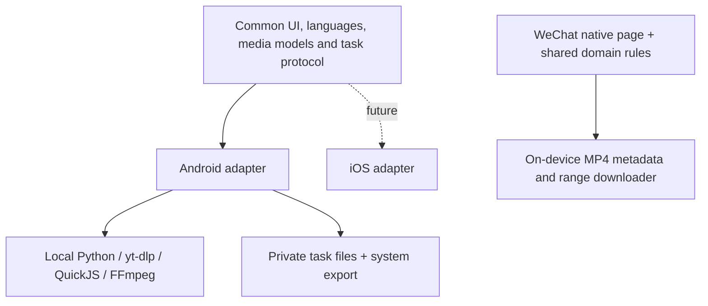

# Mobile targets, implementation and acceptance

## Confirmed decisions

- 2026-09-19: prioritize the PC and Android on-device entry/install flow; defer
  further WeChat work until after them. The website provides entry/distribution
  only and must not relay video or perform platform extraction for clients.

- Develop Web, Android and WeChat first; defer iOS implementation while preserving useful common code.
- Android and iOS must analyze/download on the phone, without a required ClipNest service.
- **WeChat must also run entirely on the phone.** A companion-service architecture was explicitly declined.
- The Android app may use GPL-3.0. Web and independent common/Mini Program modules retain MIT.
- iOS implementation, build/signing setup and a distribution channel remain deferred. No sideloadable iOS build is available.
- Keep confirmation, duration/size/time estimates, live ETA, pause/resume where supported, cancellation cleanup, persistence, usable small controls and selectable languages.

## Current implementations

| Component | State | Boundary |
| --- | --- | --- |
| Web v1.3.1 | Website environment detection plus complete local downloader | Static site opens the full local UI; host performs extraction/download/merge, then browser saves |
| Android 1.4.0-alpha.2 | Java foreground-service app, bundled UI, native Python/yt-dlp/QuickJS/FFmpeg, persistent private tasks, system export; debug APK builds | On-device engine, no Web-server fallback; no member login; device/source acceptance and production signing remain separate gates |
| WeChat 1.4.0-alpha.1 | Native Mini Program page, direct HTTPS MP4 metadata parser and downloader, resumable range checkpoints, cancellation, album export | No server; no platform share-page extraction or separate-track merge; project has no real AppID or actual WeChat device acceptance |
| iOS | Common UI/domain/protocol architecture only | No native engine adapter, Xcode project, compiled app, signature or IPA |

The narrower Mini Program implementation is **unfinished coverage**, not a user-approved removal of multi-platform goals. The requirement for entirely on-device operation is preserved.

## Reuse for iOS

`clients/shared/` contains portable domain functions and additional 12-language strings. `clients/mobile-ui/` is a reusable bundled mobile view. `clients/engine/worker.py` uses the Web's pure media interpretation/URL validation modules; its subprocess entrypoint is Android-specific. `clients/shared/README.md` defines the native command/response contract.

iOS cannot use Android's binary/process launcher or foreground service. It needs compatible embedded extraction and media-processing libraries plus native lifecycle/export integration. Android success is not iOS validation.

## Validation evidence and limits

- Android ARM64/x86_64 debug APK compilation completed; lint reported 0 errors and 2 warnings. Installation and three instrumentation tests on an isolated Android 16 x86_64 emulator passed: local interface/language switching, consent/demo/cache deletion, and an actual bundled Python/yt-dlp loopback download plus FFmpeg remux/audio/video checks. These tests do not establish live-platform or physical-phone acceptance.
- Node tests exercise shared URL/format logic and the Mini Program downloader with a **real local HTTP server**: pause, persistence/reload, Range offsets, exact final bytes, changed source identity, ignored Range and cancellation deletion.
- MP4 metadata tests inspect original 480p, 720p and 1080p fixtures and confirm duration, dimensions, 24 fps, AVC video and AAC audio.
- Mini Program adapter tests are not WeChat Developer Tools compilation or phone tests. No current official WeChat policy/limit verification is claimed: official documentation access was blocked in this session.
- No cloud CI run, production signing, app-store submission or Mini Program publication is claimed. Repository tags and Releases record the actual source/package publication state.

## Remaining gates before production distribution

1. Android: representative ARM64 physical-device tests, actual authorized links per claimed platform, source authorization errors, large-file/low-storage behavior, process interruption, real-source pause/resume, installation and upgrade with an owner-controlled release key.
2. Complete the [matching-source and notice record](../clients/android/NATIVE_DISTRIBUTION.md) for bundled native dependencies before publicly distributing Android binaries, including previews.
3. WeChat: actual AppID/project and legal media-host configuration, developer-tool compilation, Android/iPhone WeChat API/storage/background/album tests; complete feasible on-device platform extractors and media processing before claiming Web parity.
4. iOS: choose and validate the actual embedded/native engine on macOS/Xcode and a real iPhone; implement the platform adapter and chosen signing/distribution flow.
5. Review exact repository/source/asset list with the owner and obtain the required final GitHub publication confirmation.

Build/use instructions: [Android](../clients/android/README.md), [WeChat](../clients/wechat/README.md), [Web](WEB_INSTALL.md), [release conventions](RELEASING.md).
