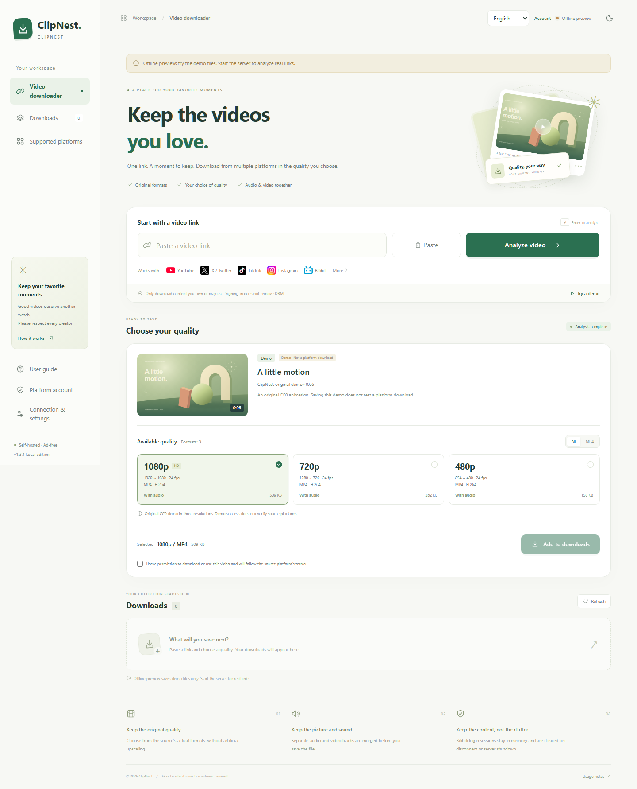

# ClipNest — 留住喜欢的视频。

[English](en.md) · [简体中文](zh-CN.md) · [繁體中文](zh-TW.md) · [日本語](ja.md) · [한국어](ko.md) · [Español](es.md) · [Français](fr.md) · [Deutsch](de.md) · [Português](pt.md) · [Русский](ru.md) · [العربية](ar.md) · [हिन्दी](hi.md)

[体验界面](https://xialuyu5-oss.github.io/clipnest/preview/?lang=zh-CN) · [查看源码](../../README.md) · [安装说明](../LOCAL_PROCESSING.md)

ClipNest 让你选择来源格式，查看时长与预计大小，每次确认后再下载。过程中可查看进度和剩余时间估计，来源支持时暂停续传，取消则删除缓存。

这里是界面预览，无需安装即可试用项目原创动画。预览不能解析真实平台链接，演示成功也不代表平台下载已通过验收。

## 在自己的设备上完成

PC 用户先安装并启动本机组件，网站检测环境后打开完整工具。解析、视频传输和合并都在你的电脑上进行，ClipNest 网站不转发视频流量。

## 一个入口，19 个来源平台

源码接入 19 个平台的专用解析器，入口使用易辨认的官网图标。最近新增的九个平台尚未全部通过实链验收；可用性取决于来源权限、地区和平台变化。

## 移动端的能力与边界

Android 开发预览内置本机引擎，公开 APK 分发及真机验收尚待完成。微信小程序预览目前只处理 MP4 直链。iOS App 尚未提供。

代码由 OpenAI Vibe Coding 开发，使用 ChatGPT 和 Codex。这是独立项目，并非 OpenAI 官方产品。

仅下载自己拥有或获准使用的内容。ClipNest 不解除 DRM。

[MIT](../../LICENSE) · Android: [GPL-3.0-only](../../clients/android/LICENSE)
